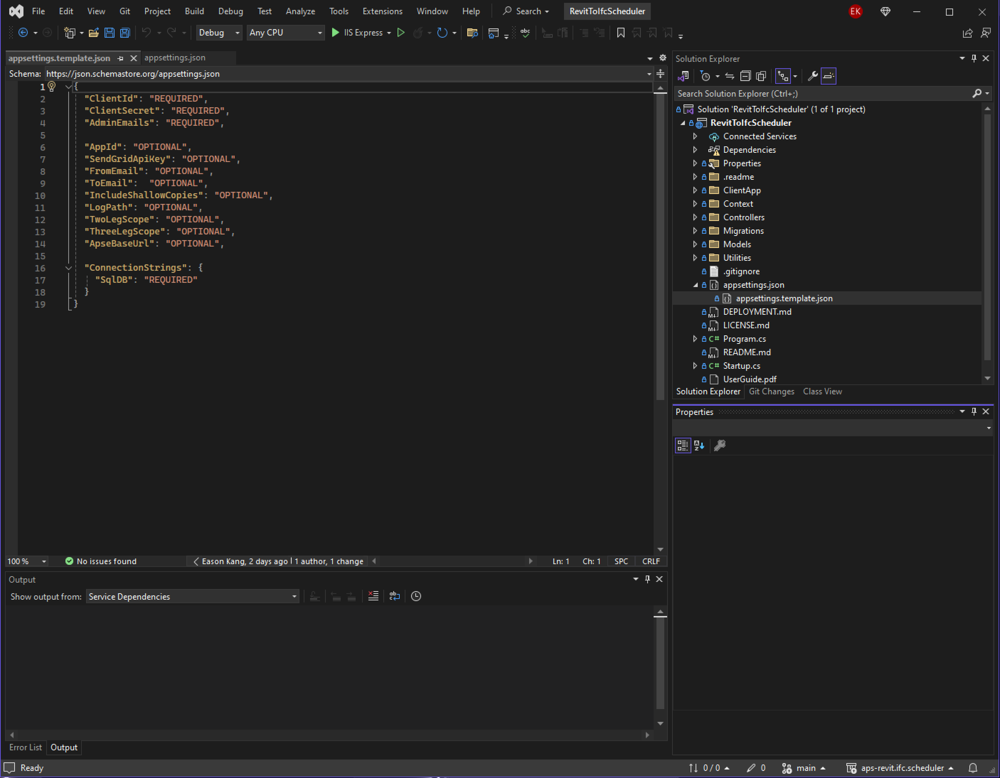
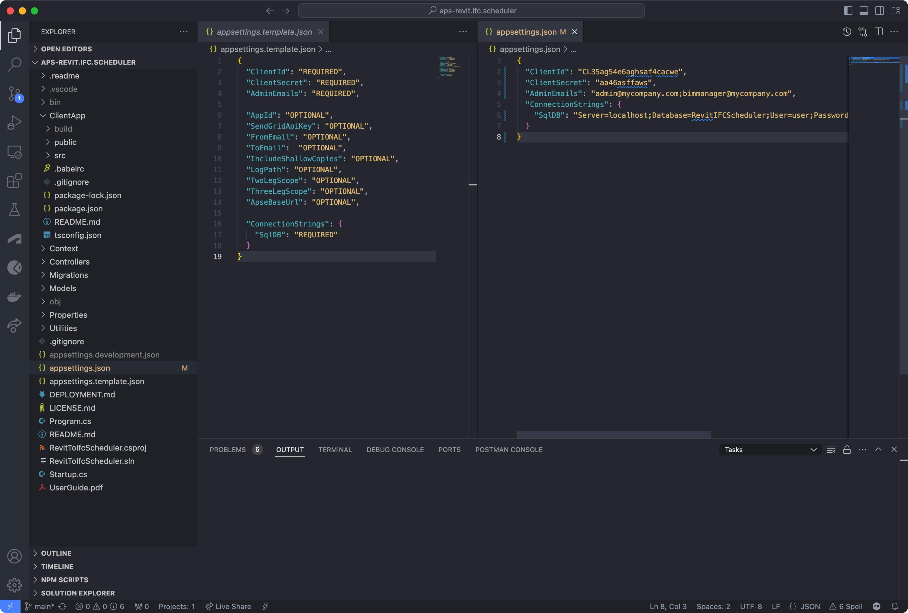

# Revit to IFC Scheduler — Design Automation Edition


[](https://opensource.org/licenses/Apache-2.0)

[](http://aps.autodesk.com/)
[](http://aps.autodesk.com/)
[](https://aps.autodesk.com/en/docs/design-automation/v3/developers_guide/overview/)
[](https://aps.autodesk.com/en/docs/acc/v1/reference/http/locations-nodes-GET/)

[](http://aps.autodesk.com/)

### Contents

* [Description](#description)
* [How this differs from the original scheduler](#how-this-differs-from-the-original-scheduler)
* [Setup](#setup)
* [Using the Application](#using-the-application)
* [Tips and Tricks](#tips-and-tricks)
* [License](#license)


## Description

This application converts Revit `.rvt` files stored in ACC/BIM360 Docs to `.ifc` format on demand or on a recurring schedule, using **[Design Automation for Revit](https://aps.autodesk.com/en/docs/design-automation/v3/developers_guide/overview/)** and the MIT-licensed [RevitIfcExporter appbundle](https://github.com/ADN-DevTech/aps-revit-ifc-exporter-appbundle).

It is a fork of Autodesk's [aps-revit.ifc.scheduler](https://github.com/autodesk-platform-services/aps-revit.ifc.scheduler) sample, with the conversion engine swapped from the Model Derivative API to Design Automation for Revit.

The [IFC file format](https://technical.buildingsmart.org/standards/ifc/) is a common transfer format used throughout the world, and consumed by a wide range of applications. Users choose either folders or specific files, then choose an IFC Settings Set, and set a schedule on which the folders or files should be converted to IFC. At the scheduled time, the application submits a Design Automation workitem for each file, and uploads the resulting IFC file into the same folder as the original Revit file. If the Revit file and IFC Settings Set have not changed since the last conversion, no job will be created.

**Note.** [Design Automation API](https://aps.autodesk.com/en/docs/design-automation/v3/developers_guide/overview/) incurs cost (billed per processing time via Flex tokens/cloud credits). Please review the [APS Pricing page](https://aps.autodesk.com/pricing).

## How this differs from the original scheduler

The Model Derivative IFC export only accepts the *name* of an IFC export setup that must already be saved inside each published Revit model. Running the export through Design Automation for Revit removes that limitation:

* **Upload your export setup JSON directly.** An IFC Settings Set can now carry the JSON exported from Revit's IFC Export dialog (`Modify Setup… > Save selected setup`). Nothing needs to be saved inside the Revit models.
* **Export from a specific 3D view.** A settings set can specify a view UniqueId and/or the "only export elements visible in view" toggle — even if the saved setup didn't have it enabled.
* **User-defined property sets in the cloud.** Upload the Pset definition `.txt` alongside the setup; the exporter uses it instead of the (unreachable) file path baked into the setup.
* **Predictable exporter version.** You choose the Revit engine (2021–2026) that runs the export, instead of whatever the Model Derivative service uses.

The rest of the application — ACC/BIM360 browsing, scheduling (Hangfire + cron), conversion history, email notifications, dual SQL Server/PostgreSQL support — is unchanged from the original.


## Thumbnail


## Limitations

* This application will only work on Revit files that are uploaded directly to ACC/BIM360 Docs / Autodesk Docs, or published models from cloud worksharing.
* The Design Automation engine version must be greater than or equal to the Revit version of the converted files (older files are upgraded in-session when opened). Files from a Revit version newer than the configured engine will fail.
* Prebuilt appbundle ZIPs exist for Revit engines 2021–2024 and 2026. For other engines, build the appbundle from [source](https://github.com/ADN-DevTech/aps-revit-ifc-exporter-appbundle) and point `DesignAutomation:AppBundleZipPath` at the ZIP.
* View UniqueIds are model-specific, so the "3D View UniqueId" option of a settings set is only meaningful for settings sets dedicated to a single model.


## Setup

### Prerequisites

* [Visual Studio](https://code.visualstudio.com/): Either Community 2019+ (Windows) or Code (Windows, MacOS).
* [.NET 8.0](https://dotnet.microsoft.com/en-us/download/dotnet/8.0)
* [NodeJS (with NPM)](https://nodejs.org/en/download/)
* A supported database engine — either SQL Server or PostgreSQL:
  * [SQL Server](https://www.microsoft.com/en-us/sql-server/sql-server-downloads) (default)
    * For installing SQL Server on `Windows` machines, please see [Microsoft's SQL Server installation guide](https://docs.microsoft.com/en-us/sql/database-engine/install-windows/install-sql-server?view=sql-server-ver15)
    * For installing SQL Server on `Linux` machines, please see [Microsoft's Installation Guidance for SQL Server](https://docs.microsoft.com/en-us/sql/linux/sql-server-linux-setup?view=sql-server-ver15)
    * For `Cloud-hosted` SQL, options include:
      * [Azure SQL](https://azure.microsoft.com/en-us/products/azure-sql/)
      * [Amazon RDS for SQL Server](https://aws.amazon.com/rds/sqlserver/)
  * [PostgreSQL](https://www.postgresql.org/download/) (16 or newer recommended)
    * For `Cloud-hosted` PostgreSQL, options include [Azure Database for PostgreSQL](https://azure.microsoft.com/en-us/products/postgresql/) and [Amazon RDS for PostgreSQL](https://aws.amazon.com/rds/postgresql/).
* Basic knowledge of C#
* Autodesk APS App provisioned to your ACC/BIM360 account

### Running locally

Clone this project or download it. It's recommended to install [GitHub desktop](https://desktop.github.com/). To clone it via command line, use the following (**Terminal** on MacOSX/Linux, **Git Shell** on Windows):

```bash
git clone https://github.com/libnypacheco/revit-design-automation-ifc-scheduler.git
```

* **Visual Studio** (Windows):

    Open the project [RevitToIfcScheduler.csproj](RevitToIfcScheduler.csproj), find [appsettings.template.json](appsettings.template.json) in the solution window, copy and rename it to `appsettings.Development.json`.



* **Visual Studio Code** (Windows, MacOS):

    Open the folder, at the bottom-right, select **Yes** and **Restore**. This restores the packages (e.g. Autodesk.SdkManager, Autodesk.Authentication, Autodesk.DataManagement, Autodesk.ModelDerivative, Autodesk.Oss, etc.) and creates the launch.json file.

    Afterward, find [appsettings.template.json](appsettings.template.json) in the explore window, copy and rename it to `appsettings.Development.json`.



Edit the `appsettings.Development.json` file, adding your APS Client ID, Secret, emails for Application Admins, and your database connection string.

For SQL Server (default):

```json
{
  "ClientId": "your id here",
  "ClientSecret": "your secret here",
  "AdminEmails": "your admin user emails here",
  "ConnectionStrings": {
    "SqlDB": "Server=localhost;Database=RevitIFCScheduler;User=sa;Password=...;TrustServerCertificate=True;"
  }
}
```

For PostgreSQL, set the `DatabaseProviderConfiguration.ProviderType` to `PostgreSQL` and supply a Npgsql-format connection string:

```json
{
  "ClientId": "your id here",
  "ClientSecret": "your secret here",
  "AdminEmails": "your admin user emails here",
  "ConnectionStrings": {
    "SqlDB": "Host=localhost;Database=RevitIFCScheduler;Username=postgres;Password=..."
  },
  "DatabaseProviderConfiguration": {
    "ProviderType": "PostgreSQL"
  }
}
```

When the `DatabaseProviderConfiguration` section is omitted, the application defaults to `SqlServer`. Both Entity Framework Core (application schema) and Hangfire (job storage) honor the selected provider. On startup, the appropriate migration set is applied automatically — SQL Server migrations live in `Migrations/` and PostgreSQL migrations in `Migrations/PostgreSQL/`.

Run the app. Open `http://localhost:3000` in your browser to view the application.

### App Settings Variables

Name | Description | Example Value
--- | --- | ---
ClientId | From the APS App created during Setup | _CL35ag54e6aghsaf4cacwe_
ClientSecret | From the APS App created during Setup | _aa46asffaws_
AdminEmails | Semicolon-separated list of email addresses | _admin@mycompany.com;bimmanager@mycompany.com_
ConnectionStrings.SqlDB | Database connection string. Format depends on `DatabaseProviderConfiguration.ProviderType`. |  _SQL Server:_ `Server=MY-SERVER;Database=revit-to-ifc-scheduler;Trusted_Connection=True;ConnectRetryCount=0` &#124;&#124; _PostgreSQL:_ `Host=MY-SERVER;Database=revit-to-ifc-scheduler;Username=postgres;Password=...`

#### Optional App Settings

Name | Description | Default Value
--- | --- | ---
DatabaseProviderConfiguration.ProviderType | Which database engine to use. Supported values: `SqlServer`, `PostgreSQL`. When the entire `DatabaseProviderConfiguration` section is omitted, `SqlServer` is used. | SqlServer
DesignAutomation.Engine | The Design Automation for Revit engine used to run IFC exports. The engine version must be >= the Revit version of the converted files. | Autodesk.Revit+2026
DesignAutomation.AppBundleZipUrl | URL of the RevitIfcExporter appbundle ZIP to upload during provisioning. When omitted, a prebuilt ZIP matching the engine is downloaded from the [appbundle releases](https://github.com/ADN-DevTech/aps-revit-ifc-exporter-appbundle/releases). | _null_
DesignAutomation.AppBundleZipPath | Local file path of the appbundle ZIP, taking precedence over `AppBundleZipUrl`. Use this for engines without a prebuilt release, or for air-gapped servers. | _null_
DesignAutomation.PublicHostUrl | Public https URL of this application (e.g. `https://myscheduler.azurewebsites.net`). **Strongly recommended**: when set, Design Automation delivers the IFC output through the app's non-expiring callback endpoint. When empty, a signed OSS URL is used, which the OSS API hard-caps at 60 minutes — exports still running ~55 minutes after submission will fail to upload. | _null_
AppId | A name for the application, used when naming cookies and buckets | revit-to-ifc
SendGridApiKey | If email notifications are desired, an API key from SendGrid should be provided | _null_
FromEmail | The email address that SendGrid should attempt to put into the 'From' field | _null_
ToEmail | The email address that SendGrid should attempt to put into the 'To' field | _null_
LogPath | The specific path where log files should be stored | _null_
IncludeShallowCopies | Copying a file in ACC/BIM360 does not create a new file, only a reference to the original file, and cannot be passed to the model derivative service. Setting this to true will make a true copy of the file, and pass that to the model derivative service.  | true
TwoLegScope | The APS scopes used by two legged tokens (`code:all` is required for Design Automation) | account:read data:read data:create data:write bucket:read bucket:create code:all
ThreeLegScope | The APS scopes used by three legged tokens | user:read data:read data:create

### Deployment Steps
 
Please see the [Deployment Guide](./DEPLOYMENT.md).


## Using the Application

Please see the [User Guide.pdf](./UserGuide.pdf) for additional details.

#### Initial Setup

1. Navigate to the tool using your browser.
2. Log in using your ACC/BIM360 account (your email address must be included in the AdminEmails Environment Setting)
3. Navigate to Settings by clicking `Settings` in the top right corner
4. Toggle on the desired ACC/BIM360 accounts.
5. In the `Design Automation` section, press `Provision Design Automation`. This uploads the RevitIfcExporter appbundle and creates the activity under your APS application (one-time step; repeat after changing the engine).
6. Add an IFC Settings Set using the `Add IFC Settings Set Name` button. A settings set can be either:
   * **A name only** — the name of an IFC export setup saved inside your Revit models, or one of Revit's built-in setups (see [Further Reading](#further-reading)); or
   * **An uploaded setup JSON** — exported from Revit's IFC Export dialog (`Modify Setup… > Save selected setup`). Optionally add a user-defined property sets `.txt`, a 3D view UniqueId, and/or the "only export elements visible in the view" toggle.

#### Creating a one-off conversion to IFC

1. Navigate to the tool using your browser.
2. Log in using your ACC/BIM360 account.
3. Choose a project on the left-hand side.
4. Navigate through the folder tree until you see the desired folders or files.
5. Select the checkboxes next to the desired folders or files.
6. Press `Convert Selected to IFC Now` in the upper right-hand corner.
7. Choose the desired IFC Settings Set Name, or type in a new name.
8. The conversion will begin immediately, but may take several minutes to complete.
9. To view the status of the conversion, press the `Conversion History` button to see all past conversions within this project.

#### Creating a scheduled conversion to IFC

1. Navigate to the tool using your browser.
2. Log in using your ACC/BIM360 account.
3. Choose a project on the left-hand side.
4. Navigate through the folder tree until you see the desired folders or files.
5. Select the checkboxes next to the desired folders or files.
6. Press `Create Schedule Conversion` in the upper right-hand corner.
7. The application will automatically create a scheduled run on a daily schedule.
8. You may change the following settings for the schedule: 
   1. Schedule Name
   2. IFC Settings Set Name
   3. Frequency (Daily, Weekly, etc.)
   4. The days on which the schedule should repeat
   5. The time at which the schedule should repeat
   6. The time zone at which the schedule should repeat
9. The conversion will begin at the next scheduled event.
10. To view the status of the conversion, press the `Conversion History` button to see all past conversions within this project.

#### Conversion Statuses

Name | Description
--- | ---
Created | The IFC conversion job is created and enqueued successfully.
Processing | A Design Automation workitem has been submitted, and the model is being converted to IFC.
Success | The IFC has been generated and uploaded to the ACC/BIM360 Docs folder where the source Revit file is.
Failed | The conversion or upload could not be completed. Click the conversion record for details — the tail of the Design Automation report is appended to the job notes.
Unchanged | This model has previously been converted to IFC using the same IFC setting set. No additional conversion is required.
TimeOut | The Design Automation workitem exceeded the processing time limit.


# Further Reading

Documentation:

- [ACC/BIM360 API](https://aps.autodesk.com/en/docs/bim360/v1/overview/) and [App Provisioning](https://aps.autodesk.com/blog/bim-360-docs-provisioning-aps-apps)
- [Data Management API](https://developer.autodesk.com/en/docs/data/v2/overview/)
- [Design Automation API](https://aps.autodesk.com/en/docs/design-automation/v3/developers_guide/overview/)
- [RevitIfcExporter appbundle](https://github.com/ADN-DevTech/aps-revit-ifc-exporter-appbundle) (the Design Automation plugin performing the IFC export)

Related knowledge:

- [What is IFC?](https://bimconnect.org/en/software/what-is-ifc/)
- [About Revit and IFC](https://knowledge.autodesk.com/support/revit/learn-explore/caas/CloudHelp/cloudhelp/2022/ENU/Revit-DocumentPresent/files/GUID-6708CFD6-0AD7-461F-ADE8-6527423EC895-htm.html)
- [What does an IFC Settings Set Contain?](https://knowledge.autodesk.com/support/revit/learn-explore/caas/CloudHelp/cloudhelp/2022/ENU/Revit-DocumentPresent/files/GUID-E029E3AD-1639-4446-A935-C9796BC34C95-htm.html)
    - The name list of Revit built-in IFC export settings (since Revit 2017) of APS Model Derivative service:
        - IFC2x3 Coordination View 2.0
        - IFC2x3 Coordination View
        - IFC2x3 GSA Concept Design BIM 2010
        - IFC2x3 Basic FM Handover View
        - IFC2x2 Coordination View
        - IFC2x2 Singapore BCA e-Plan Check
        - IFC2x3 Extended FM Handover View
        - IFC4 Reference View
        - IFC4 Design Transfer View

### Tips and Tricks:

###### Long-running exports

Two separate clocks apply to a conversion:

1. **Signed URL expiry (60 minutes, not extendable).** All OSS signed URLs — classic `/signed` as well as `signeds3download`/`signeds3upload` — accept `minutesExpiration` values of 1–60 only. The *input* URL is unaffected by export duration (Design Automation downloads inputs when the job starts), but the *output* URL must survive queue time + the whole export. Set `DesignAutomation:PublicHostUrl` so the output is PUT to this app's callback endpoint (`PUT /api/designAutomation/output/{jobId}`, authenticated by a per-job HMAC token) instead of a signed URL — the callback never expires.
2. **Design Automation's own processing-time limit.** Workitems are subject to a service-side execution time limit (on the order of a few hours; see the [Design Automation rate limits & quotas](https://aps.autodesk.com/en/docs/design-automation/v3/developers_guide/rate-limits/da-rate-limits) page). Jobs exceeding it end as `failedLimitProcessingTime`, shown as `TimeOut` in the conversion history. This ceiling cannot be avoided by the callback endpoint — extremely heavy models may simply not fit in one workitem.

When hosting behind IIS / Azure App Service (Windows), also raise the request body size limit for the callback endpoint, since IFC output ZIPs can exceed the 30 MB IIS default — add to `web.config`:

```xml
<system.webServer>
  <security>
    <requestFiltering>
      <requestLimits maxAllowedContentLength="4294967295" />
    </requestFiltering>
  </security>
</system.webServer>
```

###### Overriding the Vite Dev Server URL

By default, the Vite development server runs on `http://localhost:5173`. If port `5173` is already in use, or you want to use a different port, you need to update **two places**:

1. **`ClientApp/vite.config.js`** — change the `server.port` value:

    ```js
    server: {
      port: 5174,   // ← your preferred port
    },
    ```

2. **`Startup.cs`** — pass the matching URL to `ViteServerMiddleware.EnsureStarted` via the optional `viteServerUrl` parameter:

    ```csharp
    viteUrl = Utilities.ViteServerMiddleware.EnsureStarted(
        env.ContentRootPath,
        lifetime.ApplicationStopping,
        viteServerUrl: "http://localhost:5174"   // ← must match vite.config.js
    );
    ```

`EnsureStarted` returns the URL it used, which is then passed directly to `UseProxyToSpaDevelopmentServer`, so only one string needs to change on the .NET side. If Vite is already listening on the specified URL when the .NET app starts (e.g. you ran `npm start` manually beforehand), startup detection is skipped and the existing server is used.

###### Sending Confirmation Emails

This tool uses SendGrid to send a confirmation email on a successful conversion. This requires creating a free SendGrid account (for up to 25,000 emails/month), verifying a 'Single Sender' email address, and retrieving an API Key with 'Send' authorization. Three optional environment settings must be set: `SendGridApiKey`, `FromEmail`, and `ToEmail`. If any one of these is left blank, no emails will be sent. 

SendGrid can be setup by creating an account at [www.sendgrid.com](https://www.sendgrid.com), or by creating a `SendGrid Accounts` resource from the [Azure Portal](https://portal.azure.com/#create/Sendgrid.sendgrid).

###### Internationalization - Additional Language Support

This application is capable of supporting multiple languages -- by default, English and Norwegian have been provided. To add additional languages, copy the folder located at `aps-revit.ifc.scheduler/ClientApp/public/locales/en`, and rename it with the appropriate language code. Search for the file named `i18next.ts`, and add the language code to the `fallbackLng` array. Finally, edit the `translation.json` and `scheduler.json` files in the folder that you just copied, and set the values on the right hand side to the appropriate translation.

When this is done, an additional language code will be shown in the header bar of the application.

###### Shallow Copies

When a file is 'shallow copied' (ACC/BIM360 makes a reference to a file that's already claimed by another BIM360 file — e.g. in 'Shared' folders or via the 'copy' function), the Model Derivative service refused to process it. Design Automation reads the file's storage object directly, so shallow copies are expected to convert without special handling; the `IncludeShallowCopies` setting is kept for compatibility but no longer drives the conversion path.

###### Modifying the Database

This tool uses Entity Framework Core in a code-first, migration based setup. Provide it with a connection  string, and it will automatically create or update the database and tables as needed.

When the tables are modified in the Data project, you will need to create a new Migration. Do do this, navigate to the 'BIM360 - Revit to IFC Converter' project, and run the following command: `dotnet ef migrations add NameOfYourMigrationHere`. The migration will be applied during the next application run.

When adding a migration, both the SQL Server and PostgreSQL migration sets must be regenerated so both providers stay in sync:

```bash
# SQL Server migration (default context, output to root Migrations/)
dotnet ef migrations add NameOfYourMigrationHere

# PostgreSQL migration (design-time-only context, output to Migrations/PostgreSQL/)
dotnet ef migrations add NameOfYourMigrationHere --context PostgreSQLRevitIfcContext --output-dir Migrations/PostgreSQL
```

###### Hangfire 1.8 upgrade

To enable the PostgreSQL storage provider, the Hangfire packages (`Hangfire.Core`, `Hangfire.SqlServer`, `Hangfire.AspNetCore`) were upgraded from `1.7.28` to `1.8.14`. `Microsoft.EntityFrameworkCore*` was bumped from `8.0.4` to `8.0.11` to match the transitive minimum of `Npgsql.EntityFrameworkCore.PostgreSQL 8.0.11`.

### Troubleshooting

1. **Cannot see my ACC/BIM360 projects**:
    * Make sure to provision the APS App Client ID within the ACC/BIM360 Account, [learn more here](https://aps.autodesk.com/blog/bim-360-docs-provisioning-aps-apps). (This requires the Account Admin permission)
    * Also, check **section 2.1 Login** and **section 2.3.1 Enabling a BIM360 account** of [UserGuide.pdf](UserGuide.pdf) for instructions.

2. **Received Microsoft.Data.SqlClient.SqlException while starting this app**: if it indicates that `there is already an object named 'XXXXX' in the database`, then this means the database you specified in `appsetings.json` is not empty. You can fix it by doing either of the below ways:
    * Comment out the `dbContext.Database.Migrate();` in [Startup.cs](Startup.cs), then restart the app.
    * Backup your database, erase the database by executing `DROP DATABASE` command in the [SQL Server Management Studio](https://docs.microsoft.com/en-us/sql/ssms/sql-server-management-studio-ssms?view=sql-server-ver15), and then restart the app.

3. **See 401 Unauthorized error after logging in**:
    * Check if the user level of the user account you logged in matches the listed roles of the  **section 2.1 Login** of [UserGuide.pdf](UserGuide.pdf).
    * If the user level of your user account is `Application Admins`, ensure that your user email is specified in the `AdminEmails` of the [App Settings Variables](#app-settings-variables).
 
## License

This application is licensed under Apache 2.0. For details, please see [LICENSE.md](./LICENSE.md).

## Written By

* Daniel Clayson, Global Consulting Delivery Team, Autodesk
* Reviewed and maintained by Eason Kang [in/eason-kang-b4398492](https://www.linkedin.com/in/eason-kang-b4398492), [Developer Advocacy and Support Team](http://aps.autodesk.com)